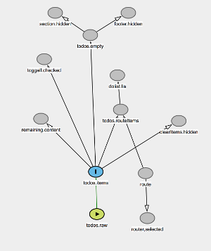

# The Matrix and mxWeb FAQ
I had to make these up for now.
## Dataflow is unchecked mutation!
We remember that feeling. In truth, a DAG of nodes deriving their values from 
functions of other nodes are just an optimization of functional programming: 
computed values are cached for performance and the cache invalidation is reliably automatic.

Guy Steele compared constraint programming to automatic garbage collection, 
except in this case the automaticity is applied to internal state consistency.
## So you think you invented dataflow?
Nope. The prior, subsequent, and concurrent art is extensive. Dataflow is the 
wheel that keeps on being reinvented. Some libraries close to Matrix in spirit 
are Common Lisp 
Garnet KR, C++ Adam/Eve, Scheme FrTime, JS MobX, binding.Scala, CLJS 
Hoplon/Javen, and the CLJS Reagent ratom.
## Why the name Matrix? Wrapping your lousy library in a popular movie?
The movies were great, but they got the word "matrix" wrong. What does it really mean? We like this definition:
> ma·trix ˈmātriks *noun* an environment in which something else takes form. *Origin:* Latin, female animal used for breeding, parent plant, from *matr-*, *mater*

In the movie, the matrix harnessed humans to suck energy out of them. In English, a matrix provides the conditions for new things to come to life. This dataflow library provides an environment in which the developer can arrange for, say, a proxy nuclear powerplant to take form. The matrix powerplant runs by itself given:
* declaratively coded connective formulae;
* glue to feed data into the matrix from inputs; and
* more glue to pipe results back out.

Turning to a safer application, the input of a user pressing the Enter key in TodoMVC procedurally extends the list of to-do items. The matrix proxy of a `UL` list sees the list grow and grows a new matrix `LI`. mxWeb observers add a new LI to the browser DOM.

Summary. The dataflow library supports a live proxy of a web page, one that mxWeb delivers continuously, transparently, and incrementally to the browser. Hence "matrix".
## What is this DAG thing you keep mentioning?
The DAG acronym expands to _directed acyclic graph_. If you know your TodoMVC spec, here is about two thirds of the implicit dependency graph:

* "directed" means one-way, an idea incidentally and wisely mandated by Flux; things get crazy when we let data run in either direction, as the constraint programming crowd can tell you.
* "acyclic" means no loops in which A on B and B depends on C and C depends on A. (Some dataflow libraries support cycles by returning the *prior* value of A if a computation circles back to A. Not Matrix, though we will give it thought if we ever need it.)
